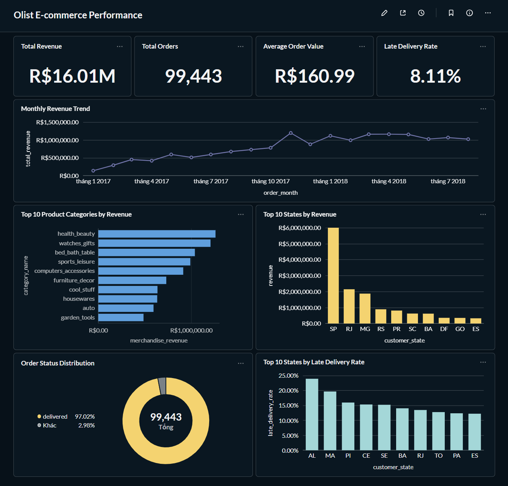
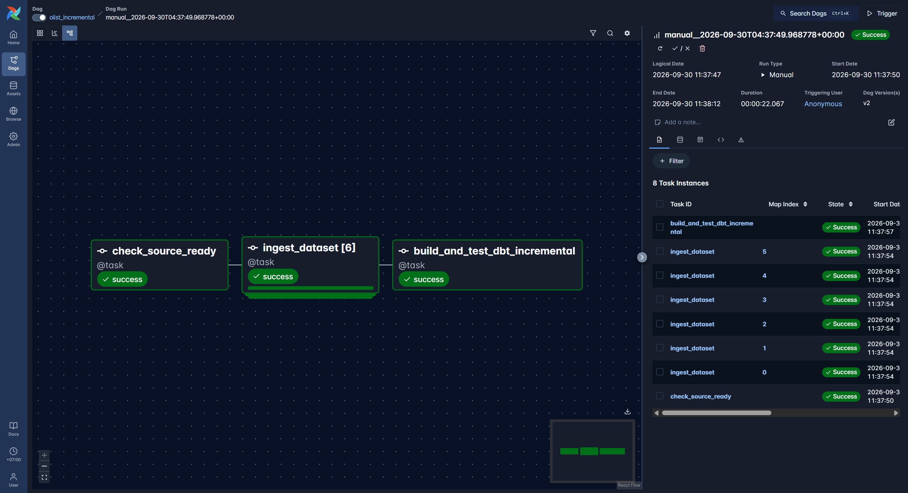
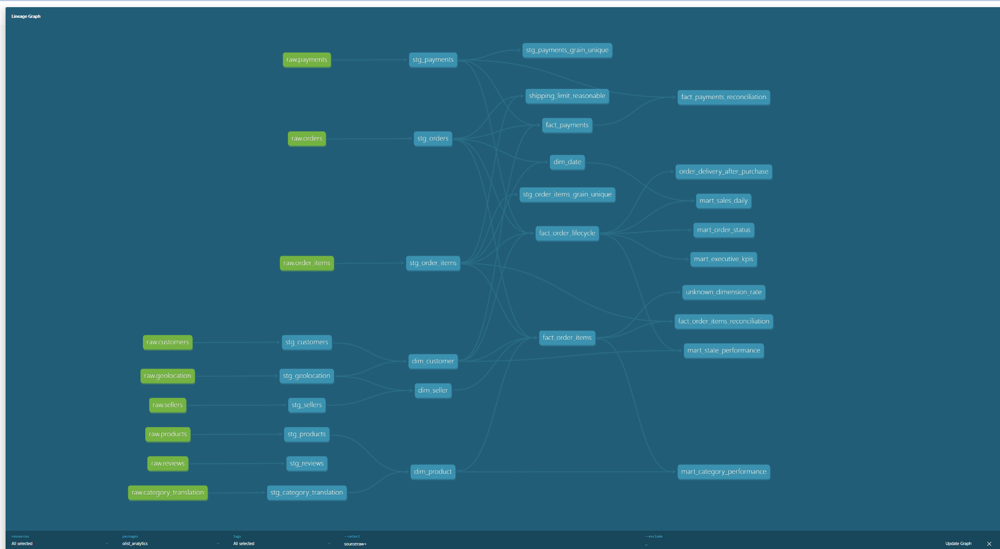

# Olist Modern Data Platform

Dự án portfolio Data Engineering sử dụng dữ liệu thương mại điện tử Olist. Dự án được xây
theo từng phiên bản chạy được, bắt đầu với PostgreSQL + Python + Kimball, sau đó mở rộng sang
Airflow, Snowflake, dbt, Kafka và Spark.



## Phiên bản hiện tại (v0.4)

- Giữ nguyên 9 CSV nguồn trong vùng `data/raw/olist`.
- Data profiling tạo báo cáo JSON.
- Data contract kiểm tra schema, null, uniqueness, range và foreign key.
- Record/batch lỗi có thể được chặn trước khi load.
- PostgreSQL có bốn schema: `raw`, `staging`, `warehouse`, `audit`.
- Kimball warehouse gồm dimension và fact với grain rõ ràng.
- Audit table lưu lịch sử load và kết quả data quality.
- Airflow DAG điều phối toàn bộ full-refresh pipeline với retry, timeout và quality gates.
- Incremental ingestion dùng PostgreSQL source, `updated_at`, atomic watermark và dynamic tasks.
- dbt quản lý staging models, Kimball marts, lineage và automated data tests.
- GitHub Actions kiểm tra formatting, lint, Python tests, dbt parse và Docker Compose.
- Metabase trực quan hóa KPI từ các dbt presentation marts qua read-only database role.

## Kết quả nổi bật

- Xử lý 9 bộ dữ liệu Olist, trong đó bảng geolocation có hơn 1 triệu bản ghi.
- 21 dbt models cho staging, Kimball warehouse và analytics presentation layer.
- 78 generic data tests cùng 7 singular business-rule tests.
- Full-refresh và incremental pipeline được điều phối bằng Airflow.
- Incremental ingestion dùng watermark, upsert và có thể chạy lại an toàn.
- Metabase dashboard cung cấp KPI doanh thu, đơn hàng, giao hàng và phân tích địa lý.
- BI user chỉ có quyền đọc warehouse/analytics, không thể ghi dữ liệu hoặc đọc RAW.

KPI của bộ dữ liệu hiện tại:

| KPI | Giá trị |
|---|---:|
| Total orders | 99,443 |
| Total revenue | R$16,009,091.92 |
| Average order value | R$160.99 |
| Late delivery rate | 8.11% |

## Kiến trúc hiện tại

```text
Olist CSV
   |-- Airflow: profile + validate
   v
PostgreSQL RAW (dbt sources)
   v
dbt STAGING views (`staging_dbt`)
   v
dbt Kimball warehouse (`warehouse_dbt`)
   |-- dim_date
   |-- dim_customer
   |-- dim_product
   |-- dim_seller
   |-- fact_order_items
   |-- fact_payments
   `-- fact_order_lifecycle
   v
dbt presentation marts (`analytics_dbt`)
   |-- mart_executive_kpis
   |-- mart_sales_daily
   |-- mart_category_performance
   |-- mart_state_performance
   `-- mart_order_status
   v
Metabase (`localhost:3000`)
```

## Khởi động trên Windows

Yêu cầu: Python 3.11+, Docker Desktop và VS Code.

```powershell
Copy-Item .env.example .env
python -m venv .venv
.\.venv\Scripts\Activate.ps1
python -m pip install -e ".[dev]"
docker compose up -d --build
```

Project PostgreSQL được expose tại `localhost:5433` để không xung đột với PostgreSQL cài
trực tiếp trên Windows thường dùng cổng `5432`.

Kiểm tra dữ liệu trước khi load:

```powershell
olist-pipeline profile
olist-pipeline validate
```

Khởi tạo database, nạp raw data và xây warehouse:

```powershell
olist-pipeline init-db
olist-pipeline load-raw --replace
olist-pipeline check-raw
olist-pipeline build-warehouse
olist-pipeline validate-warehouse
```

## Chạy bằng Airflow

Airflow 3 chạy trong Docker ở chế độ standalone dành cho học tập/local development. DAG được
đặt `schedule=None` để tránh tự động full refresh; bạn phải chủ động trigger.

```powershell
docker compose up -d --build
docker compose ps
docker compose logs -f airflow
```

Mở `http://localhost:8080`, chọn DAG `olist_full_refresh`, sau đó bấm **Trigger**. Môi trường
local đang tắt authentication để dễ học; không dùng cấu hình này để public ra Internet.

dbt Docs và lineage graph chạy ở `http://localhost:8081`. Service `olist-dbt-docs` tự generate
catalog khi khởi động. Sau khi thay đổi model, refresh docs bằng:

```powershell
docker compose restart dbt-docs
```

Metabase chạy tại `http://localhost:3000`. Hướng dẫn kết nối và dashboard nằm trong tài liệu
[Visualization](docs/visualization.md).

Có thể trigger từ terminal:

```powershell
docker compose exec airflow airflow dags trigger olist_full_refresh
```

Thứ tự task full refresh:

```text
profile_source
  -> validate_source
  -> initialize_postgres
  -> load_raw_full_refresh
  -> reconcile_raw
  -> build_and_test_dbt
```

## Thử incremental loading

Khởi tạo OLTP source mô phỏng từ dữ liệu hiện tại và tạo một thay đổi mới:

```powershell
olist-pipeline init-source
olist-pipeline simulate-source
```

Trong Airflow, trigger DAG `olist_incremental`. Hoặc chạy thủ công:

```powershell
olist-pipeline ingest-incremental
olist-pipeline show-watermarks
olist-pipeline build-warehouse
olist-pipeline validate-warehouse
```

`olist_incremental` dùng dynamic task mapping cho sáu dataset. RAW được append theo watermark;
dbt staging views tự chọn phiên bản mới nhất theo natural key, sau đó dbt incremental models
upsert các dimension/fact bị thay đổi.



## Chạy dbt

Sau khi cài lại package và rebuild image Airflow:

```powershell
python -m pip install -e ".[dev]"
olist-pipeline dbt-debug
olist-pipeline dbt-build --full-refresh
```

dbt tạo hai schema riêng để bạn có thể đối chiếu với phiên bản SQL ban đầu:

- `staging_dbt`: clean, cast và deduplicate RAW.
- `warehouse_dbt`: dimensions và facts theo Kimball.
- `analytics_dbt`: presentation marts đã tổng hợp đúng grain cho BI.
- `dbt_test_failures`: lưu các dòng vi phạm test để debug.



Các lần sau chỉ cần chạy `olist-pipeline dbt-build`. Trong Airflow, full-refresh DAG truyền
`--full-refresh`, còn incremental DAG chạy dbt theo chế độ incremental.

Sau khi bắt đầu incremental ingestion, `check-raw` không còn được kỳ vọng khớp CSV vì RAW giữ
lịch sử nhiều phiên bản. Chỉ sử dụng phép đối chiếu đó ngay sau full refresh.

Nếu chưa cài package ở editable mode, có thể chạy:

```powershell
$env:PYTHONPATH = "src"
python -m olist_pipeline.cli profile
```

## Nguyên tắc dữ liệu

- Không sửa trực tiếp CSV trong `data/raw`.
- Không commit raw data hoặc `.env` lên Git.
- Validation cấp `ERROR` chặn pipeline; `WARN` được ghi nhận để theo dõi.
- Load lại raw data chỉ thực hiện khi chủ động truyền `--replace`.
- Mỗi fact table có một grain riêng; không join trực tiếp item với payment để tính doanh thu.

## Dashboard BI

Dashboard **Olist E-commerce Performance** gồm:

- Bốn KPI cards: revenue, orders, average order value và late-delivery rate.
- Monthly Revenue Trend.
- Top Product Categories by Revenue.
- Top States by Revenue.
- Order Status Distribution.
- Top States by Late Delivery Rate.

Dashboard lịch sử giới hạn purchase date trước năm 2019. Bản ghi có ngày hiện tại được tạo có
chủ đích bởi incremental simulation và được giữ lại làm bằng chứng kiểm thử pipeline, nhưng
không được trộn vào phân tích dữ liệu Olist lịch sử.

Dashboard của Metabase được lưu trong Docker volume `metabase_data`. Không chạy
`docker compose down -v` nếu muốn giữ tài khoản, câu hỏi và dashboard đã tạo.

## Portfolio evidence

Các bằng chứng trực quan được lưu trong `docs/images/`:

1. `metabase-dashboard.png` — toàn bộ dashboard đã hoàn thiện (đã thêm).
2. `airflow-incremental-dag.png` — một DAG run thành công (đã thêm).
3. `dbt-lineage.png` — lineage graph từ source đến analytics marts (đã thêm).

## Tài liệu

- [Mô hình dữ liệu](docs/data_model.md)
- [Kimball bus matrix](docs/bus_matrix.md)
- [Lộ trình triển khai](docs/roadmap.md)
- [Airflow orchestration](docs/airflow.md)
- [Incremental loading](docs/incremental_loading.md)
- [dbt transformations](docs/dbt.md)
- [End-to-end validation evidence](docs/end_to_end_validation.md)
- [CI/CD workflow](docs/ci_cd.md)
- [Metabase visualization](docs/visualization.md)
